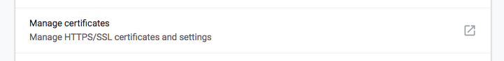
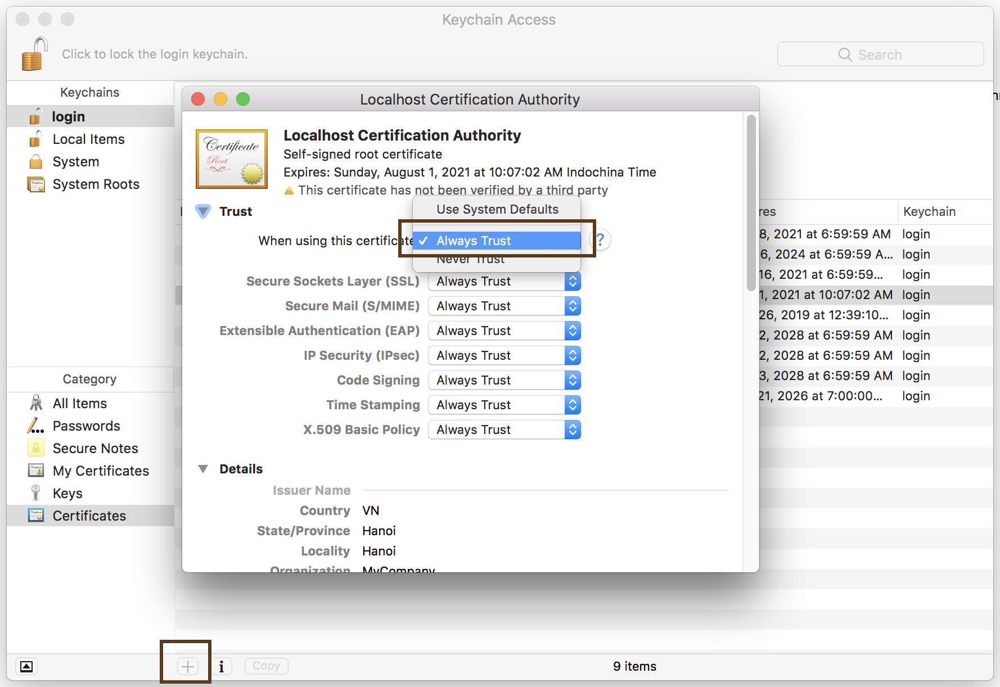

# Generate self-signed HTTPS/SSL cert

Satisfy Chromium/Chrome 58+ strict requirements for self-signed HTTPS/SSL cert

## Step 1

Create CA key and cert

```terminal
$ sh ./create_root_CA_key_and_cert.sh
```

## Step 2

Create server/domain key

```terminal
$ sh ./create_certificate_for_domain.sh {your.domain}
```

## Step 3

Add cert and key to Apache2/Nginx/... site-file, HTTPS (port 443) section.
Cert files is located at `certs` directory.

```terminal
SSLCertificateFile    /path_to_your_files/your.domain.crt
SSLCertificateKeyFile /path_to_your_files/your.domain.key
```

Or with `nodejs/express`:

```javascript
const key = fs.readFileSync(your.domain.key);
const cert = fs.readFileSync(your.domain.cert);
const ca = fs.readFileSync(rootCA.pem);
const credentials = { key, cert, ca };
const app = express();
const server = https.createServer(credentials, app);
server.listen(port, host, function() {
    console.log(`Server on https://${host}:${port}`);
});
```

## Step 4

Add cert to the browser

```
Chromium -> Setting -> (Advanced) Manage Certificates -> Import -> 'rootCA/rootCA.pem'
```




